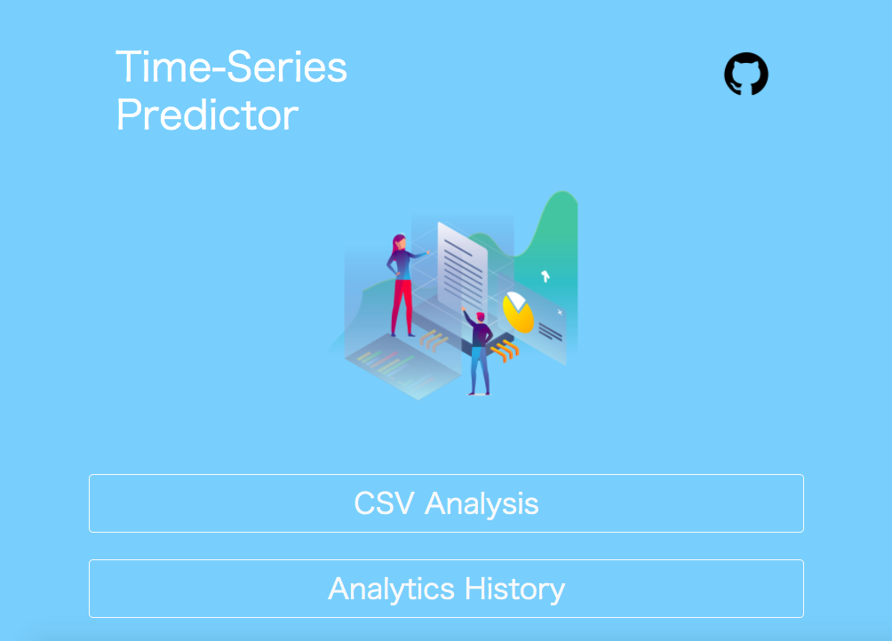

# Time-Series Predictor


# Functions
LIght Weight Machine Learning App that Learn & Predict the Future Values of Time-Series Data

## CSV Analysis
1. Learn features of data from your csv.  
2. Predict values for the specified period.  
3. Plot the prediction result as a image.  
**It can be downloaded as csv or image!**

### Internal Machine Learning Methods
- SARIMA  
**The others comming soon...**

## Analytics History
1. Catch your previous prediction results from database.  
2. Show them as a table.  
**Each line of the table can be downloaded as csv or plot image!**

# Requirements
## MacOS High Sierra v10.13.6 (local)
- Python 3.7.3
- Docker 19.03.12
- aws-cli 1.18.66
- jupyter-notebook 6.0.0

## AWS Cloud9 (https://aws.amazon.com/cloud9/)
- Python 3.6 (default)
- Docker (default)
- aws-cli (default)

# Usage
You need your own AWS account. (https://aws.amazon.com/)

## Run Local
MacOS High Sierra  

```bash
# Clone this Repository
git clone https://github.com/ogi-iii/time_series_predictor.git
cd time_series_predictor

# Deploy APIs on AWS
./quickStartApi.sh

# Run App on local environment
./quickRunLocalApp.sh
```

## Deploy on AWS
AWS Cloud9 (https://aws.amazon.com/cloud9/)  

```bash
# Add credentials into git config
git config --global credential.helper '!aws codecommit credential-helper $@'
git config --global credential.UseHttpPath true

# Register your information into git config
git config --global user.name "YOUR_NAME"
git config --global user.email "YOUR_EMAIL_ADDRESS"

# Clone this Repository
git clone https://github.com/ogi-iii/time_series_predictor.git
cd time_series_predictor/

# Deploy APIs on AWS
./quickStartApi.sh

# Create resources & Deploy on AWS
./quickDeployEcsApp.sh
```

## [Tips] Trouble Shooting
If you get an error **"no space left on device"** in Cloud9,  
remove default other docker image from Cloud9 & get enough space.

```bash
# Check docker image id
docker image ls

# Remove image that you don't use
# ex) lambci/lambda, etc.
docker image rmi -f YOUR_DOCKER_IMAGE_ID
```

# App Architecture Diagram on AWS


# Tech Skills
The list of technical skills for creating this app

## AWS  
- Infrastructure as Code  
  - VPC
  - Cloudformation  
  
- Serverless API  
  - Lambda  
  - API Gateway  
  - S3  
  - Dynamo DB  
  
- Container Service  
  - ECS  
  - ECR  
  - Fargate  
  
- CI/CD
  - CodePipeLine  
  - CodeBuild  
  - CodeCommit  

## Others
- Python   
  - flask
  - numpy
  - pandas
  - matplotlib
  - scipy
  - statsmodels  
  - etc.
  
- Machine Learning & Statistics   
  - SARIMA
  
- Docker

- Shell Script

- HTML/CSS

# Reference
## sample-data (AirPassengers.csv)
- https://www.analyticsvidhya.com/blog/2016/02/time-series-forecasting-codes-python/

## images
- https://icooon-mono.com/
- https://icon-icons.com/

## CSS
- https://csstools.github.io/sanitize.css/

## SARIMA
- https://logics-of-blue.com/python-time-series-analysis/
- https://momonoki2017.blogspot.com/2018/03/python9sarima.html

## Architecture Diagram
- https://www.edrawsoft.com/edraw-max/
